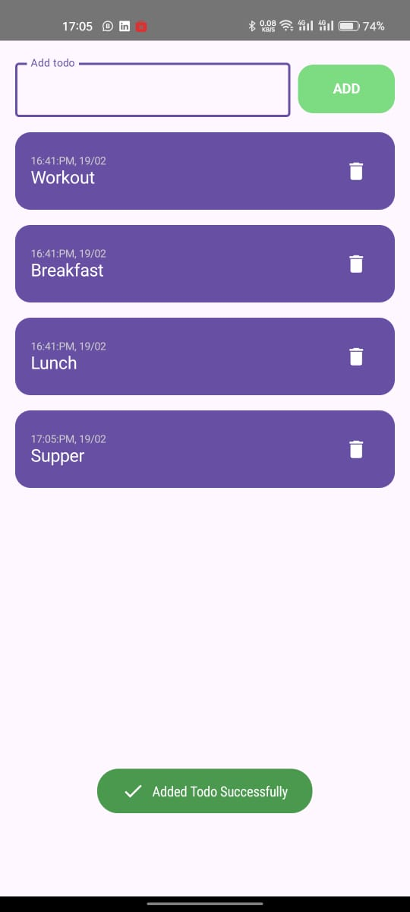
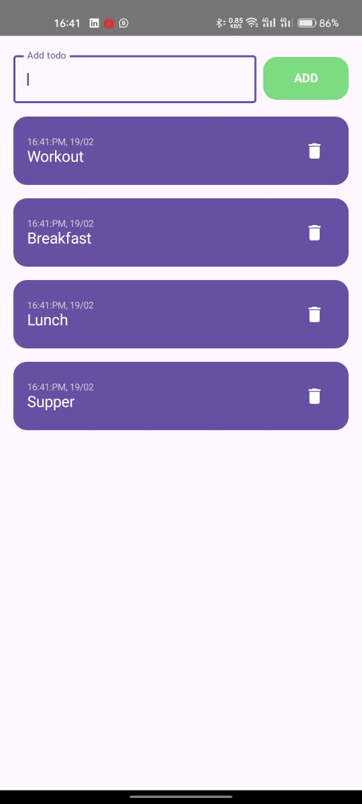
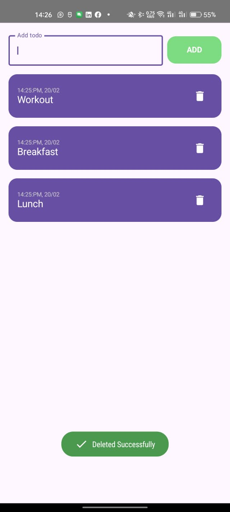

# Simple Todo App 📋
A minimal Todo application built with modern Android development tools, featuring Jetpack Compose for UI and Room Database for local data storage.

## Features ✨
Add tasks to your Todo list.
View all tasks in a clean and user-friendly interface.
Delete tasks when completed or no longer needed.
Local storage with Room Database ensures data persistence.
Fully built with Jetpack Compose for a modern declarative UI.

## Screenshots 📸
### Empty Todo

### Add a Todo                           
   

### Add an empty Todo                                     
  

### Display Todo                           

### Delete Todo                           
    

## Built With 🛠️
Jetpack Compose: Modern UI toolkit for Android.
Room Database: SQLite abstraction for local storage.
Kotlin: Primary programming language for Android development.
### LiveData/StateFlow: Manage and observe UI state reactively.
